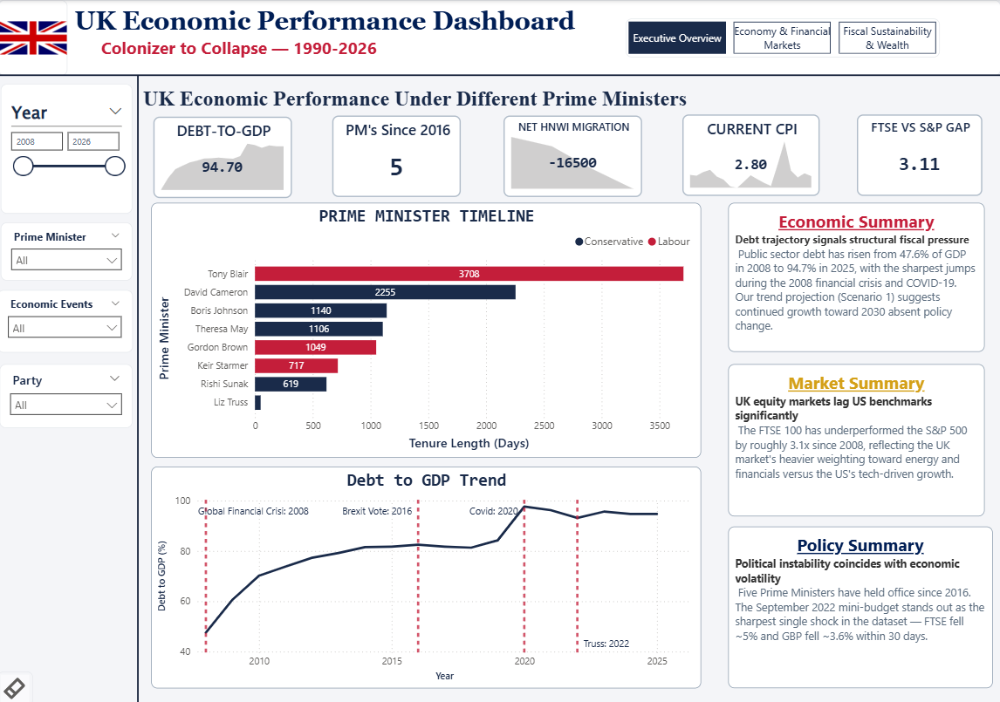
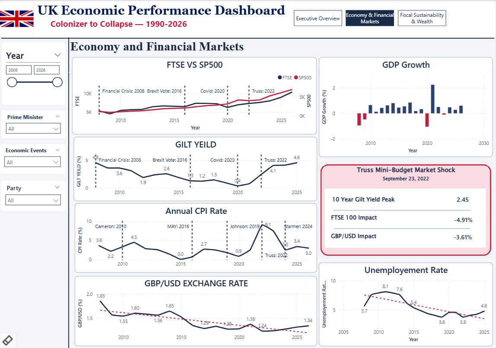
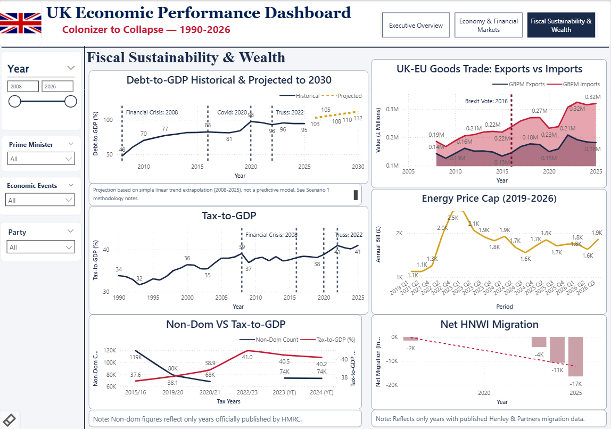

# Colonizer to Client State: UK Political & Economic Decline (2008-2026)

A data analytics deep-dive into 18 years of UK political instability and economic pressure — six Prime Ministers, Brexit, the Truss mini-budget bond crisis, rising public debt, the Ukraine energy shock, and a wave of wealth flight — built end-to-end with **Python, SQL, and Power BI**.

## The Story

Since the 2016 Brexit referendum, the UK has cycled through six Prime Ministers in under a decade — including Liz Truss, whose 44-day tenure ended after an unfunded "mini-budget" triggered a bond market crisis, crashed the pound, and forced an emergency Bank of England intervention. This project asks: how do political instability and economic performance actually connect, using real data rather than headlines?

## Dashboard Preview





## Project Structure

```
├── data/raw/          15 source datasets (ONS, Bank of England, HMRC, Ofgem, Henley & Partners)
├── notebooks/          Full analysis notebook — cleaning, SQL, EDA, scenario modeling
├── sql/schema.sql       MySQL star schema (3 dimension tables, 7 fact tables)
├── dashboards/          Power BI (.pbix) file — 3-page interactive dashboard
├── visuals/             Saved chart exports from the EDA and scenario modeling stages
└── screenshots/         Dashboard page screenshots + ER diagram
```

## Data Sources

All data is sourced directly from official/primary sources and manually verified:
- **ONS** — CPI inflation, GDP growth, debt-to-GDP, unemployment, real wages, UK-EU trade
- **Bank of England** — 10-year gilt yields
- **HMRC** — non-domiciled taxpayer counts
- **Ofgem** — energy price cap history
- **Henley & Partners** — high-net-worth individual migration
- **Yahoo Finance / Google Finance** — FTSE 100, S&P 500, GBP/USD

## Tech Stack

- **Python** (pandas, matplotlib, seaborn, numpy) — data cleaning, EDA, scenario modeling
- **MySQL** — star schema data warehouse, 15 SQL queries (window functions, CTEs, subqueries)
- **Power BI** — 3-page interactive dashboard with DAX measures, cross-filtering, and event annotations

## Database Schema


A star schema with `dim_date`, `dim_pm`, and `dim_event` as dimension tables, and 7 fact tables covering markets, macroeconomic indicators, and wealth/fiscal metrics.

## Key Findings

- **Liz Truss's 44-day tenure** saw average CPI inflation of 11.1% — by far the worst of any PM in the dataset
- The **mini-budget crisis** caused FTSE to fall ~5% and GBP/USD to fall ~3.6% within 30 days
- **Real wages fell for 6 consecutive years** (2009-2014) following the financial crisis
- **Tax-to-GDP hit an all-time high of 41%** in 2025, even as non-dom taxpayer counts fell ~38%
- The UK's average annual **trade deficit with the EU nearly doubled** post-Brexit-vote (-£56.8bn → -£103.1bn)
- **FTSE 100 has underperformed the S&P 500 by roughly 3.1x** since 2008

## Scenario Modeling

Four data-analysis-based (non-ML) scenarios: a linear debt-to-GDP trend projection to 2030, gilt yield sensitivity analysis, an energy shock replay using the actual 2022 crisis magnitude, and a misery index projection under continued Iran War disruption. Full methodology notes are included in the notebook.

## How to Reproduce This

1. Set up a local MySQL instance and run `sql/schema.sql` to build the empty schema
2. Open `notebooks/main.ipynb` and update the database connection details
3. Run the notebook cells in order — this loads all 15 datasets, runs the SQL analysis, and generates the EDA/scenario charts
4. Open `dashboards/UK_Dashboard.pbix` in Power BI Desktop and point it at your local database

## Author

Built by Jaskirat, in collaboration with [friend's name] — a self-directed portfolio project combining interests in economics, geopolitics, and data analytics.
